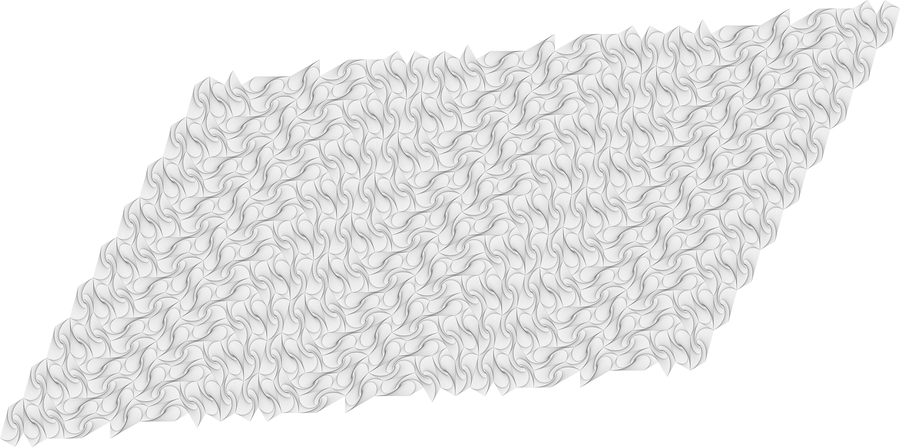

Convex Polygon Whirl Tessellations
==================================

A program to generate [whirl](http://mathworld.wolfram.com/Whirl.html) patterns
of convex polygons while tesselating the plane. Sample images generated include
the following.

Square
------
[](images/square.png)

Hexagon (with Holes!)
---------------------
[](images/hexagon.png)

Triangle
--------
[](images/triangle.png)

Pentagon Type 14
----------------

[](images/whirl-14.png)

Pentagon Type 15
----------------

[](images/whirl-15.png)

Usage
=====

Try out some preconfigured examples in the `Makefile`

```
> make help
help        Display this message.
tile-15     Create a pentagonal-15 tiling of the plane.
tile-14     Create a pentagonal-14 tiling of the plane.
square      Create a square tiling of the plane.
triangle    Create a triangular tiling of the plane.
hexagon     Create a hexagonal tiling of the plane.
```

or use the program directly via command line.

```
python main.py -h
usage: main.py [-h] W H polygon fpath whirl_iterations whirl_step

Create tesslations of pentagonal whirls.

positional arguments:
  W                 Width of tesselations in tiles.
  H                 Height of tesselations in tiles.
  polygon           Type of pentagon
  fpath             Type of pentagon
  whirl_iterations  Number of iterations to whirl a polygon inwards.
  whirl_step        Step size for each whirl.

optional arguments:
  -h, --help        show this help message and exit
```
